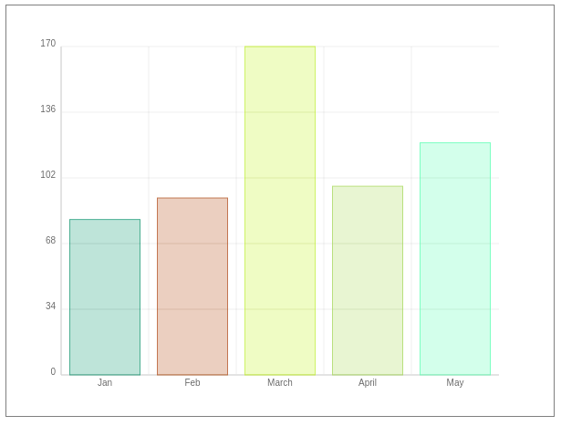

# simple-barchart
very simple barchart lib


## Description
bar.js is a Canvas based simple JavaScript Bar Chart Library to provide a configurable, lightweight and dependency-free experience.



## Installation
Download the `bar.min.js` and include it in your project.

``` html
<script src="bar.min.js></script>
```

## Usage 
To create the bar chart, you need a block level container lik a `div` or `p`.

``` html
<div id="chart">This will be bar chart!</div>
```

Then you can create the BarChart object in your JavaScript file.

``` javascript
let barchart = new BarChart(chartId, chartWidth, chartHeight, data);
```

### Parameters
- `chartId` - container (String)
Defines the id of container like "chart"
- `chartWidth` (Integer)
Defines the width of the chart like 500
- `chartHeight` (Integer)
Defines the height of the chart like 500
- `data` (Object Array)
Defines the data objects. The objects should have 2 key-value pairs: label and value. Example data:

``` javascript
const data = [{
            label: 'Jan',
            value: 15
        },
        {
            label: 'Feb',
            value: 152
        },
        {
            label: 'March',
            value: 315
        },
        {
            label: 'April',
            value: 125
        },
        {
            label: 'May',
            value: 13
        }
    ];
```

## Licence 
[MIT](LICENCE.md) ©️ [igenex](https://github.com/igenex/)